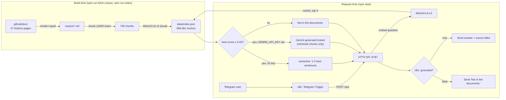

# docs-answer-bot

A small retrieval-augmented question-answering bot over 27 pages of the GitHub Actions documentation.
It chunks the pages, embeds them locally with `Xenova/all-MiniLM-L6-v2` (transformers.js, no API key),
retrieves the top 3 chunks by cosine similarity, and either answers from those chunks or says
"Not in the documents." when nothing is similar enough. Without a key it answers extractively and works
offline once the model is cached; with `GEMINI_API_KEY` it asks Gemini to write the answer from the
retrieved chunks only. An n8n workflow puts it behind a Telegram bot. Everything runs on free tiers.

## Architecture



## Quick start

Node 22 or newer. The first run downloads the embedding model (~90 MB) into `.cache/huggingface`.

```sh
npm ci
npm start            # http://localhost:8787 (PORT to change); run the curl in a second terminal
curl -s -X POST localhost:8787/ask -H "content-type: application/json" -d '{"question":"What is the maximum size of a GitHub Actions secret?"}'
```

Real responses from the server (no API key, `HF_OFFLINE=1`, so no network was used after the model was cached):

```json
{"grounded":true,"answer":"Secrets are limited to 48 KB in size.\nTo store larger secrets, see [Using secrets in GitHub Actions](https://docs.github.com/en/actions/how-tos/write-workflows/choose-what-workflows-do/use-secrets#storing-large-secrets).","sources":[{"title":"Secrets reference","path":"reference/security/secrets.md","score":0.664},{"title":"Using secrets in GitHub Actions","path":"how-tos/write-workflows/choose-what-workflows-do/use-secrets.md","score":0.66},{"title":"Secrets reference","path":"reference/security/secrets.md","score":0.634}]}
```

```sh
curl -s -X POST localhost:8787/ask -H "content-type: application/json" -d '{"question":"Who won the FIFA World Cup in 2022?"}'
```

```json
{"grounded":false,"answer":"Not in the documents.","sources":[]}
```

Other commands:

| Command | What it does |
|---|---|
| `npm test` | Unit tests (`node:test` via tsx). No network, no model. |
| `npm run eval` | Runs `eval/questions.json`, writes `eval/results.md`, exits 1 below the gate. No API key. |
| `npm run ask -- "question"` | One question from the command line. |
| `npm run fetch-corpus` | Re-downloads the corpus from the pinned github/docs commit. |
| `npm run index` | Rebuilds `data/index.json` (about 3 minutes on a laptop CPU). |
| `GET /health` | Returns `{"ok":true}`. |

`POST /ask` takes `{"question": "..."}`: a non-empty string of at most 500 characters (bodies over 8 KB are
rejected). It returns `{ grounded, answer, sources: [{ title, path, score }] }`, with `path` relative to
`corpus/`.

### Optional: Gemini answers

```sh
GEMINI_API_KEY=... GEMINI_MODEL=<a current model id from Google AI Studio> npm start
```

`GEMINI_MODEL` is required when the key is set; the server refuses to start without it. The refusal
threshold still applies first, so Gemini is never called for a question the retriever could not match.
The prompt contains only the retrieved chunks and tells the model to reply "Not in the documents." when
they do not contain the answer; that reply is returned as `grounded: false`. If the Gemini call fails,
the bot logs a warning and falls back to the extractive answer.

## Eval results

`npm run eval` on `eval/questions.json`: 15 questions that the corpus answers (each with the page that
answers it) and 5 that it does not (2 off-topic, 3 about GitHub but outside these pages). No API key.
Full per-question output: [`eval/results.md`](eval/results.md).

| Metric | Value |
|---|---|
| Retrieval hit@3 (answerable, n=15) | 1.00 |
| Refusal accuracy (unanswerable, n=5) | 1.00 |
| Answered rate (answerable, n=15, not gated) | 1.00 |
| Gate: hit@3 ≥ 0.8 and refusal ≥ 0.8 | PASS |

How the threshold was chosen, from the same run:

| threshold | answerable answered | unanswerable refused |
|---|---|---|
| 0.60 | 100% | 80% |
| 0.62 | 100% | 80% |
| **0.63** | **100%** | **100%** |
| 0.64 | 93% | 100% |
| 0.70 | 73% | 100% |

Read these numbers with care: the threshold was calibrated on these same 20 questions, so the refusal
result is in-sample. The lowest answerable top score was 0.638 and the highest unanswerable one 0.626
("How do I enable two-factor authentication on my GitHub account?"), a gap of 0.012. On new questions,
expect both false refusals and false answers.

## n8n + Telegram

[`n8n/telegram-rag-workflow.json`](n8n/telegram-rag-workflow.json):
Telegram Trigger → HTTP Request (`POST {{ $env.DOCS_BOT_URL }}/ask`) → IF `grounded` →
Telegram "Send answer" (answer and unique source titles) or "Send refusal" ("Not in the documents.").
Credentials are referenced by name (`Telegram account`); the file contains no tokens.

1. Start both services: `docker compose up -d --build`
   (set `BOT_PORT` / `N8N_PORT` if 8787 or 5678 are already in use on your machine).
2. Import the workflow:
   `docker compose exec n8n n8n import:workflow --input=/workflows/telegram-rag-workflow.json`
3. Open n8n at http://localhost:5678, create a Telegram credential named `Telegram account` with a bot
   token from [@BotFather](https://t.me/BotFather), and select it in the three Telegram nodes.
4. Telegram delivers updates only to a public HTTPS URL. Set `N8N_WEBHOOK_URL` to your tunnel or domain
   before `docker compose up`, then activate the workflow.

Compose sets `N8N_BLOCK_ENV_ACCESS_IN_NODE=false` so the workflow can read `DOCS_BOT_URL`. That also lets
any workflow read the n8n container's environment, so keep other secrets out of it.

What was verified on this machine with Docker: `docker compose up` started both containers, the bot
container downloaded the model and answered `POST /ask` from inside the n8n container via
`http://bot:8787`, `n8n import:workflow` reported "Successfully imported 1 workflow." on n8n 2.39.8,
`n8n export:workflow` returned all five nodes and their connections, and the node type versions used
(`telegramTrigger` 1.2, `httpRequest` 4.2, `if` 2.2, `telegram` 1.2) exist in that n8n image.
The workflow was **not** run end to end with a real Telegram bot.

## What this demo does not do

- **Small, fixed corpus.** 27 pages of GitHub Actions docs from one github/docs commit, rendered for the
  github.com (Free/Pro/Team) version. No GitHub Enterprise Server variants, no updates.
- **The refusal gate is a similarity threshold, not understanding.** It is calibrated on 20 questions
  (see above). Example seen while testing: "How do I run a workflow every day at midnight?" is refused
  although the corpus explains cron schedules. A GitHub-flavoured question outside the corpus can also
  score above 0.63 and get an unrelated extractive answer.
- **Extractive answers are sentence picks.** They can be incomplete or unhelpful; for "How do I cancel a
  workflow run that is in progress?" it returns the page's intro sentence rather than the steps.
- **The Gemini path is tested only with a stubbed `fetch`.** It was not run against the real API here.
- **The HTTP API has no authentication or rate limiting.** Run it on localhost or a private network.
- **The n8n workflow has no error branch.** A non-text Telegram message (photo, sticker) makes `/ask`
  return 400 and the execution fails; the user gets no reply.
- No conversation memory, no re-ranking, no approximate-nearest-neighbour index (brute force over 749
  chunks is enough here), English only.

## Project layout

```
corpus/            27 markdown pages + ATTRIBUTION.md (CC BY 4.0)
data/index.json    749 chunks with 384-dim vectors (built by npm run index)
eval/              questions.json, run-eval.ts, results.md
n8n/               telegram-rag-workflow.json
scripts/           fetch-corpus.ts, liquid.ts, build-index.ts, ask.ts
src/               chunker, embedder, search, answer, gemini, http handler, server
test/              node:test suites
```

## License and attribution

Code: [MIT](LICENSE), © 2026 Shivam Bhadoriya.

Corpus: the files in `corpus/` (and the chunk text inside `data/index.json`) are adapted from
[GitHub Docs](https://github.com/github/docs) by GitHub, Inc. and contributors, licensed under
[CC BY 4.0](https://creativecommons.org/licenses/by/4.0/). Liquid templating was rendered, screenshots
were removed and links were made absolute; details and the page list are in
[`corpus/ATTRIBUTION.md`](corpus/ATTRIBUTION.md). GitHub does not endorse this project.

Embedding model: [`Xenova/all-MiniLM-L6-v2`](https://huggingface.co/Xenova/all-MiniLM-L6-v2), Apache-2.0,
downloaded at runtime and not redistributed here.
