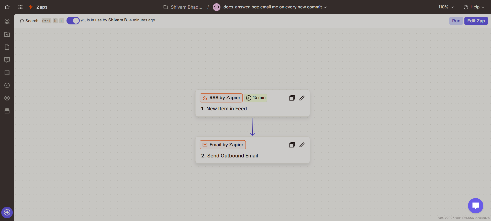

# Zapier: email on every new commit

A live two-step Zap on the Zapier **Free** plan (both apps are Zapier built-ins, so no premium app is needed):

| Step | App | Event | Settings |
|---|---|---|---|
| 1 | RSS by Zapier | New Item in Feed | Feed URL `https://github.com/Dev-Shivam-05/docs-answer-bot/commits/main.atom`, "Different Guid/URL" |
| 2 | Email by Zapier | Send Outbound Email | To: the maintainer · Subject: `docs-answer-bot: new commit` · Body: commit title + link |

The Zap polls the feed every 15 minutes (the Free plan's interval) and sends one email per new commit.
It was built and tested on 2026-09-20; both steps passed Zapier's step test before publishing.

Why RSS and not a webhook: "Webhooks by Zapier" is a premium app, so a Free-plan Zap cannot receive a GitHub
webhook. The commits Atom feed gives the same signal with a delay of at most 15 minutes.

To build the same Zap: Create Zap → trigger **RSS by Zapier → New Item in Feed** → paste the feed URL above →
action **Email by Zapier → Send Outbound Email** → map *Title* and *Link* from step 1 into the body → Publish.
